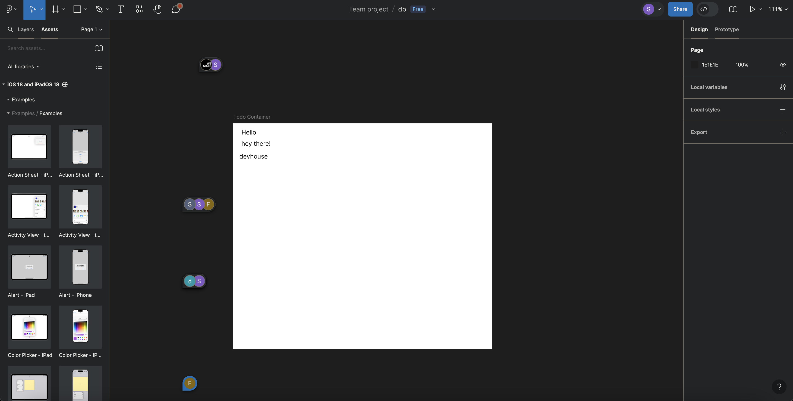
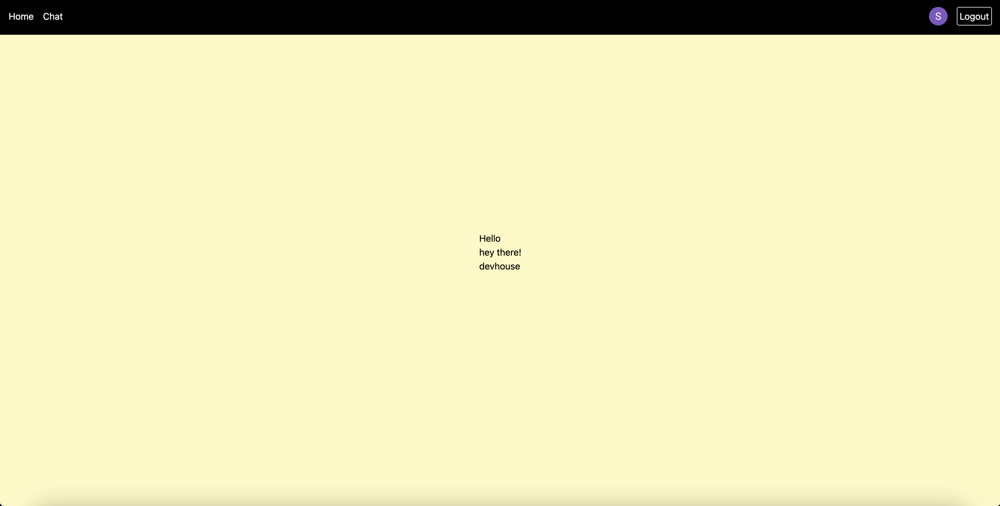
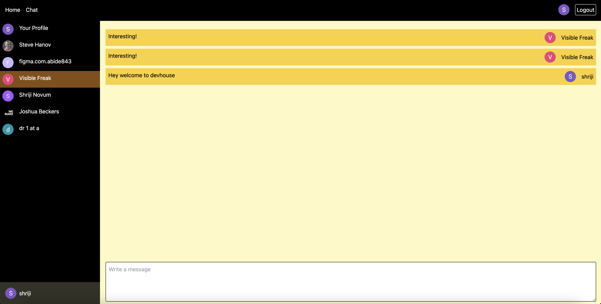

# Figma as a database - Do not use in production!

Uses Figma's REST APIs to grab text nodes of target file.
Create your app from https://www.figma.com/developers/apps and grab client id and secret for OAuth to work.

[Docs](https://www.figma.com/developers/api) here.

## How todo list works

 Insert your text nodes on the editor.

Loading this endpoint gives the text node

```ts
const response = await fetch(`${BASE_URL}/files/${FILE_KEY}`);
const file = (await response.json()) as GetFileResponse;
//process first element the array assuming you have only one child.
const [target] = data.file.document.children.flatMap((e) => e.children);
const children = (target as unknown as CanvasNode).children;
const todo = children.flatMap((e) => (e as HasTextSublayerTrait).characters);
// todo: string[]
```

Returns [GetFileResponse](https://github.com/figma/rest-api-spec/blob/main/dist/api_types.ts#L4164)

## Env vars

```
BASE_URL=https://api.figma.com/v1
APP_NAME=
CLIEND_ID=
CLIENT_SECRET=
ACCESS_TOKEN=
APP_URL=http://localhost:5173


# Project Vars
FILE_KEY= # First part you see in the URL https://www.figma.com/design/<FILE_KEY>

```



## Scrapbook system

Uses the figma comment API to maintain a thread.

### Seed initial data of the user

See [+layout.server.ts](<src/routes/(app)/chat/+layout.server.ts#L42>)

```ts
const seedData = async (locals: App.Locals, cookies: Cookies) => {
	if (!locals.user || !locals.user.id) return [];

	const now = new Date();
	// store a local copy in server to prevent API calls
	cookies.set('seeded', String(now), {
		path: '/',
		sameSite: true,
		httpOnly: true,
		maxAge: 300
	});
	const API = locals.figma();
	let result = await API.getComments(FILE_KEY);
	const ifUserExists = result.comments.some((e) => e.user.id === locals.user!.id);

	if (!ifUserExists) {
		if (result.comments.length > 0) {
			const [firstComment] = result.comments;
			const totalComments = result.comments.length;
			const offset = 50;
			const firstCommentY = (firstComment.client_meta as Vector).y || 0;
			await API.postComment(FILE_KEY, 'Profile', {
				x: 0,
				y: firstCommentY + offset * totalComments
			});
		}

		result = await API.getComments(FILE_KEY);
	}

	setCachedComments(result.comments);
	return result.comments;
};
```



#### If you are reading this doc, you might have already seen the demo, please open an issue if you have difficulties setting up. The hosted version is no longer available.
